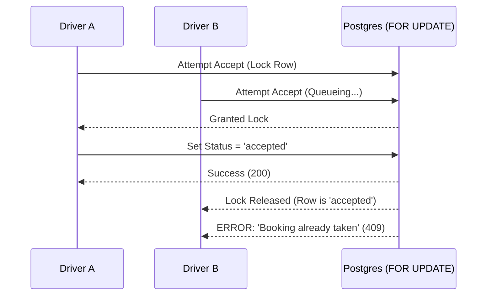

# ZingDrive – Advanced Developer Onboarding Encyclopedia

Welcome to the internal technical documentation for ZingDrive. This document is a deep-dive into the system's guts, intended for developers who will be maintaining or extending the core logistics and financial layers.

---

## 📚 Encyclopedia Roadmap
1. [Project Mission & Business Logic](#1-project-mission--business-logic)
2. [Network & Security Architecture](#2-network--security-architecture)
3. [The `src/` Directory: Micro-Level Breakdown](#3-the-src-directory-micro-level-breakdown)
4. [Database Encyclopedia (Tables & Columns)](#4-database-encyclopedia-tables--columns)
5. [Backend Logic Catalog (Edge Functions & RPCs)](#5-backend-logic-catalog-edge-functions--rpcs)
6. [Advanced Coding Standards (Good vs Bad)](#6-advanced-coding-standards-good-vs-bad)
7. [Complex Flow Sequence Diagrams](#7-complex-flow-sequence-diagrams)
8. [Advanced Debugging & System Maintenance](#8-advanced-debugging--system-maintenance)

---

## 1️⃣ Project Mission & Business Logic

ZingDrive isn't just a cab app; it's a **trust-management system**.

### 💼 The Business Model
- **Monetization**: Drivers pay for "Credits". No credits = No ride visibility.
- **Trust Maturity**: A driver starts as `new`. They must move through `pending` (KYC uploaded) to `verified` before the "Accept" button even renders.
- **Asset Integrity**: Vehicles are treated as first-class citizens. A driver can have multiple vehicles, but each must be individually verified by an admin.

### 🎭 User States
- **Driver**: `unverified` -> `pending` -> `verified`.
- **Subscription**: `inactive` -> `active` -> `expired`.

---

## 2️⃣ Network & Security Architecture

### 🔐 Multi-Layer Security
1. **Transport**: All mobile-to-backend traffic is over HTTPS.
2. **Identity**: Supabase Auth (GoTrue) handles JWT issuance. JWTs include the `role` (admin/driver) in their metadata.
3. **Authorization (RLS)**: The database is "self-policing". Even if a driver bypasses the UI and hits the DB directly with an `UPDATE`, the RLS policies and SQL triggers will block sensitive changes.
4. **Logic Enforcement (Edge)**: High-risk operations (Money/Bookings) use **Point-to-Point** trust. Mobile calls Edge -> Edge calls RPC (Security Definer).

---

## 3️⃣ The `src/` Directory: Micro-Level Breakdown

| Folder | Purpose | Key File Examples |
| :--- | :--- | :--- |
| **`api/`** | Service Layer. Wraps raw HTTP calls into typed functions. | `supabase.ts` (Client Init) |
| **`components/`** | UI Atoms & Molecules. No screen-level state here. | `Button.tsx`, `BookingCard.tsx` |
| **`constants/`** | The "Single Source of Truth" for enums and config. | `Colors.ts`, `Routes.ts` |
| **`hooks/`** | Logic-only React Hooks. Handles fetching and status. | `useAuth.ts`, `useSubscription.ts` |
| **`navigation/`** | The brain of the app's flow (Stack/Tab/Drawer). | `RootNavigator.tsx` |
| **`screens/`** | Page-level Orchestrators. Connects Hooks to Components. | `auth/LoginScreen.tsx` |
| **`store/`** | Persistent Global State (Zustand). | `useUserStore.ts` |
| **`theme/`** | Design System tokens (Spacing, Typography, Shadow). | `CommonStyles.ts` |
| **`types/`** | Global TypeScript interfaces/types. | `database.types.ts` |
| **`utils/`** | Pure functions (Regex, Formatters, Calculators). | `currency.ts` |

---

## 4️⃣ Database Encyclopedia (Tables & Columns)

### 👤 `public.profiles`
| Column | Type | Description |
| :--- | :--- | :--- |
| `id` | `uuid` | Primary Key (matches `auth.users`). |
| `role` | `enum` | `admin` or `driver`. |
| `full_name`| `text` | User's legal name. |
| `is_verified`| `bool` | Master toggle for system access. |
| `verification_status`| `enum` | `new`, `pending`, `verified`, `rejected`. |

### 🚗 `public.vehicles`
| Column | Type | Description |
| :--- | :--- | :--- |
| `id` | `uuid` | Unique vehicle ID. |
| `driver_id`| `uuid` | FK to owner profile. |
| `vehicle_type`| `enum` | `SUV`, `Sedan`, `Hatchback`, etc. |
| `status` | `enum` | `pending`, `verified`, `rejected`. |
| `is_active`| `bool` | Which vehicle the driver is currently using. |

### 📅 `public.bookings`
| Column | Type | Description |
| :--- | :--- | :--- |
| `id` | `uuid` | Unique booking ID. |
| `status` | `enum` | `open`, `accepted`, `started`, `completed`, `cancelled`. |
| `assigned_driver_id`| `uuid` | FK to `profiles.id` (if accepted). |
| `fare_estimate`| `numeric`| Estimated earnings for driver. |

---

## 5️⃣ Backend Logic Catalog (Edge Functions & RPCs)

### ⚡ Edge: `accept-booking`
- **Logic**: 
    1. Authenticates User.
    2. Validates `booking_id` and `vehicle_id`.
    3. Calls `accept_booking_transaction` RPC.
- **Failures**: Returns `409` (Already Accepted) or `403` (Not Eligible).

### 🛠️ RPC: `accept_booking_transaction`
```sql
-- Internal Logic Steps (Simplified)
1. SELECT FOR UPDATE on Booking (Row Lock).
2. Check if Status = 'open'.
3. Verify Driver is_verified = true.
4. Verify Subscription is 'active' AND credits > 0.
5. UPDATE Booking (Assign Driver).
6. UPDATE Subscription (Deduct 1 Credit).
7. INSERT into Audit Logs.
```

---

## 6️⃣ Advanced Coding Standards (Good vs Bad)

### 🟢 React Hooks Usage
**❌ BAD (Direct Supabase Call in Screen)**
```tsx
const handleAccept = async () => {
  const { error } = await supabase.from('bookings').update({ status: 'accepted' })
}
```
**✅ GOOD (Using API Wrapper + Edge Function)**
```tsx
const { acceptBooking } = useBookings();
const handleAccept = async () => {
    try {
        await acceptBooking(bookingId);
    } catch (err) {
        Alert.alert("Error", err.message);
    }
}
```

### 🔐 Security Principle
**❌ BAD (Trusting Client for User ID)**
```tsx
// Inside Edge Function
const { user_id } = body; // DON'T DO THIS
```
**✅ GOOD (Deriving User ID from Token)**
```tsx
// Inside Edge Function
const { data: { user } } = await supabase.auth.getUser();
const userId = user.id; // TRUSTED
```

---

## 7️⃣ Complex Flow Sequence Diagrams

### � Error Case: Booking Acceptance Race Condition


---

## 8️⃣ Advanced Debugging & System Maintenance

### 🕵️‍♂️ Investigating Missing Credits
If a driver claims they paid but have no credits:
1. Check `payment_requests` for the `transaction_id`.
2. check if `status` is still `pending`.
3. If `approved` but credits are 0, check `audit_logs` for `approve_payment` failures.

### 🧹 Database Cleanup (Manual)
To reset a stuck booking for testing:
```sql
UPDATE public.bookings 
SET status = 'open', assigned_driver_id = NULL 
WHERE id = 'BOOKING_ID';
```

---

> [!CAUTION]
> **Production Safety**: Never run `DELETE` queries on `profiles` or `audit_logs` without a technical lead's approval. These are critical for legal compliance.

🏁 **Onboarding Complete. Welcome to the team!**
